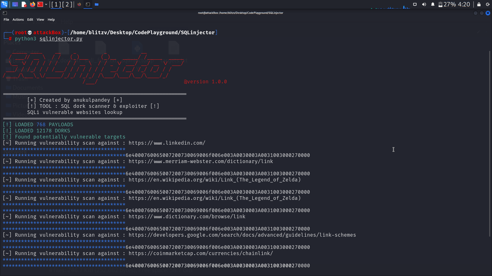

# SQL Injector

Scans the clearnet for potentially vulnerable websites, then makes thousands of requests to the endpoint for sql injection scanning.

Long story short : ``Run this script to find sql injection vulnerabilities in website all over the globe.``

## Features

- Searches for potentially vulnerable websites
- Performs directory fuzzing at the vulnerable endpoints
- Comes with built in searching algorithm
- Requires an API key for more results

  
## Screenshots

SQLinjector


## Pre Requisites

Python Installed

```bash
version > 3.0
```

## Installation
```bash
git clone https://github.com/anukulpandey/sqlinjector
cd sqlinjector
```
## Run locally
```bash
python3 sqlinjector.py
```
Make sure to use an API key for searching google , else this script won't run. You can request your private search key from cloud.google.com
## Authors

- [@anukulpandey](https://www.github.com/anukulpandey)

  
